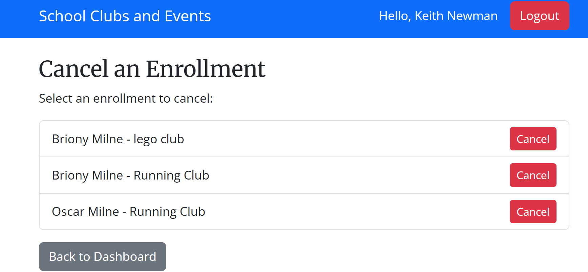

# Features

## Introduction
The following paragraphs will explain the features of each section of the project.

## Signup
The signup process lets users create a new account with role-based access. It includes detailed validation: required fields are checked, teachers must register with a `.sch.uk` email, and passwords must meet strict security criteria (minimum length, uppercase, number, and special character). Helpful error messages guide users through corrections, and successful registration prompts them to log in.

## Login and logout
The login system allows users to securely access their accounts. After authentication, users are redirected to dashboards tailored to their role (teacher or parent), ensuring they only see features relevant to them. Login errors are clearly displayed, making it easy for users to correct mistakes. Defensive coding is utilised to avoid unwanted logout.

## Navbar
The navbar is fully responsive, appearing as a dropdown menu with a burger icon on smaller screens and as a horizontal list on larger screens. It includes a link to the home page, displays the logged-in user’s status (or a link to the login page if not logged in), and provides an option to log out.

## Create Club
Teachers can create new clubs or events through a guided form that ensures all details are valid. The system enforces rules such as unique club names, valid age ranges, correct date and time ranges, and positive capacity. One-off events are also validated to have matching start and end dates. Successful creation provides a confirmation message and adds the club to the teacher's dashboard.

## Manage Clubs
Teachers can manage existing clubs with the ability to update details or delete them entirely. All updates go through the same robust validation checks as during creation, preventing invalid entries. Deletion is confirmed via a prompt to avoid accidental removal. This allows teachers to keep their club information accurate and up-to-date.

## View Clubs
Teachers can view all clubs they manage along with detailed enrollment information. For each enrolled child, teachers can access individual profiles to monitor participation and details. This feature ensures that teachers have full visibility over their clubs and can manage enrollments effectively.

## Create Children
Parents can create new child records linked to their account through a guided form. The system enforces validations such as age limits (children must be between 4 and 18 years old) and prevents duplicate entries for the same child. Upon successful creation, a confirmation message is displayed, and the child is added to the parent's dashboard.

## View/Edit Children
Parents can view all children associated with their account as cards for easy browsing. Each child's details can be edited via a dedicated form, allowing parents to keep information accurate and up-to-date. Deletion of a child record is also supported, with a confirmation step to prevent accidental removal.

## View All Clubs
Parents can browse a list of all available clubs and events, organised by date and time. This gives parents a clear overview of options for their children and helps them make informed decisions about enrollments.

## Enroll
Parents can enroll their children into clubs or events through a guided form. The system ensures that only children belonging to the logged-in parent can be enrolled, checks for duplicate enrolments, verifies that the child meets the club's age requirements, and confirms that the club is not already full. Successful enrollments display a confirmation message and update the parent's dashboard.

## Cancel Enrollment
Parents can view all current enrollments for their children and cancel them if needed. Each cancellation includes server-side checks to ensure only authorised parents can remove an enrollment. Upon successful cancellation, a confirmation message is displayed, and the enrollment is removed from the parent's dashboard.

## Validations
For all forms in the project, a number of validations were necessary to avoid user error and incorrect data being processed into the system. See the below screenshots for a number of examples of these: 

