# School Clubs and Events

## Introduction

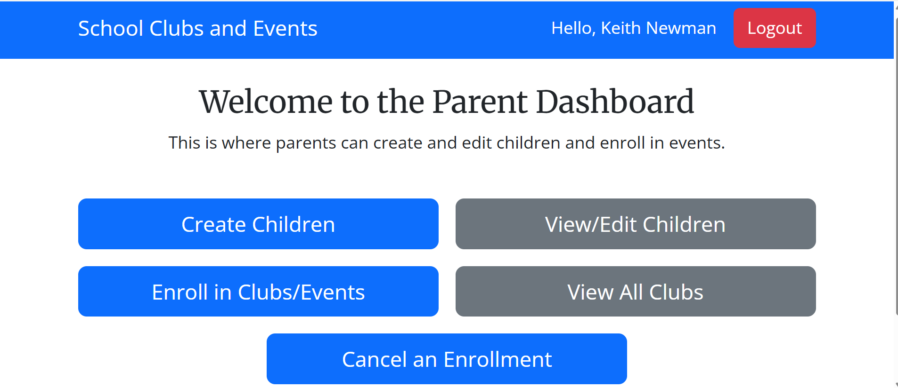
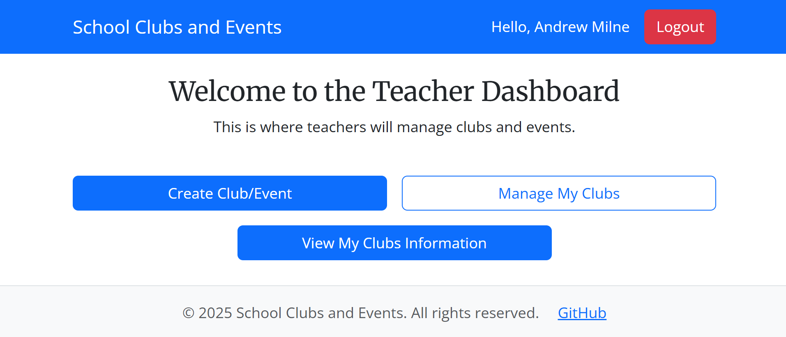

The **School Clubs and Events** website is a Django-based project designed to support teachers and parents with the efficient running of a school. The main target users are **parents** and **teachers**.  

- **Teachers** can create and manage school clubs and events, including scheduling, updating details, and tracking enrolments.  
- **Parents** can register their children and sign them up for relevant events and clubs, making participation simple and streamlined.

Live version: [School Clubs and Events](https://project-four-school-clubs-25dd4c328f23.herokuapp.com/)  
Repository: [GitHub](https://github.com/andrewpmilne/project-four-school-club-events-bookings)  
This app is created by [Andrew Milne](https://github.com/andrewpmilne)

## User Experience Design

### Strategy

Developed for schools with children of any ages, the site is designed to be easy to use and intuitive. Navigation is intended to be simple and clear. As many parents will be using the app on their phones, responsive design was imperative. This style will increase the organisation and efficiency of school systems.

### Target Audience

- **Teachers:** The site will ease workload on teachers and make managing their clubs and events significantly easier.  
- **Parents:** Parents will be able to browse the options the school is offering them more easily and sign their children up for clubs and events without needing to contact the school directly.  
- **Children:** Although not users themselves, children will benefit from the ease with which they are able to attend events and clubs at school.

## Epics and User Stories

As part of an Agile process, GitHub Issues was used to create a range of Epics, which fed into User Stories, to support the design of this project and ensure a streamlined approach.

### Epics

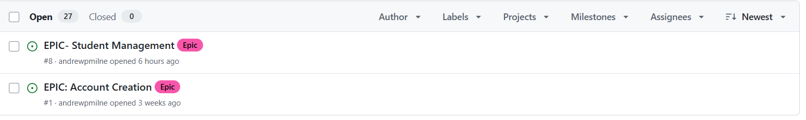  
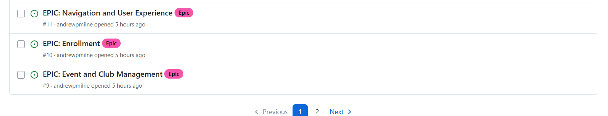  

### User Stories

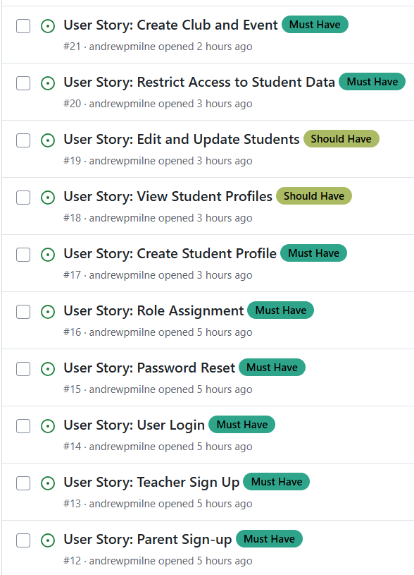  
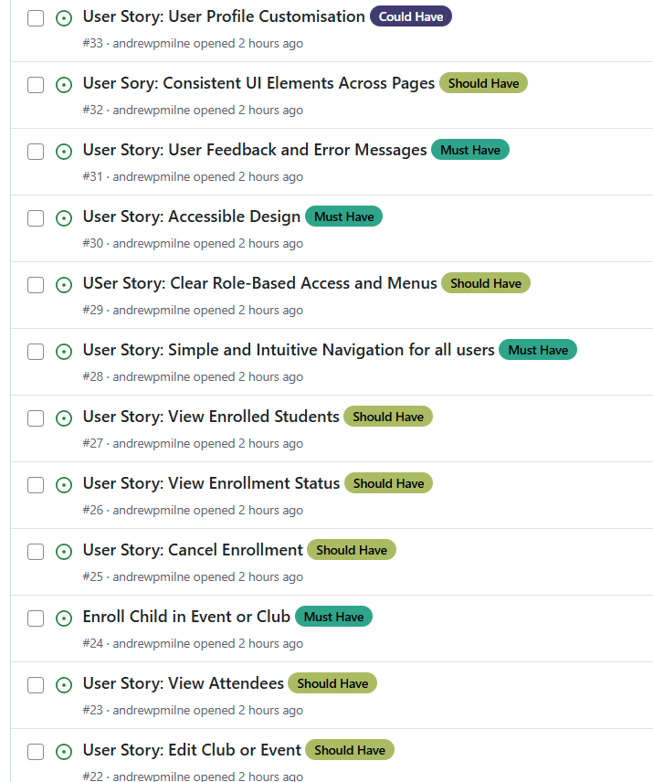  

### Example Epics and User Stories

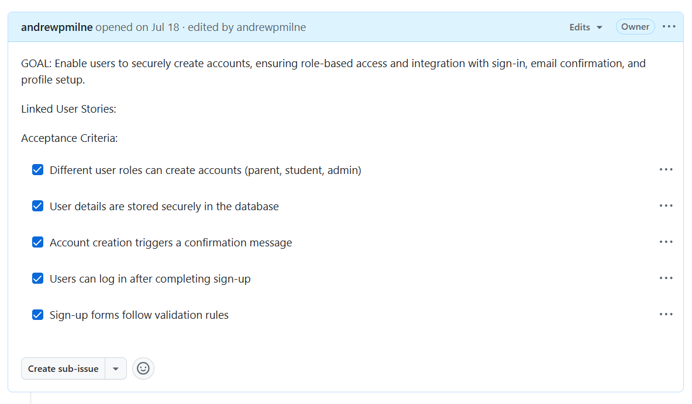  
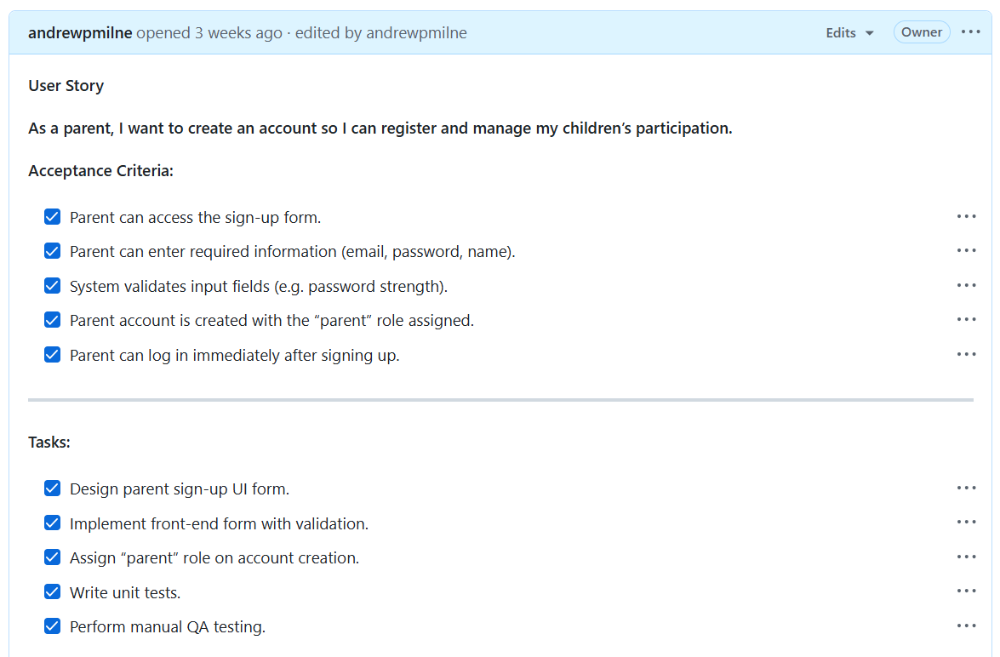  
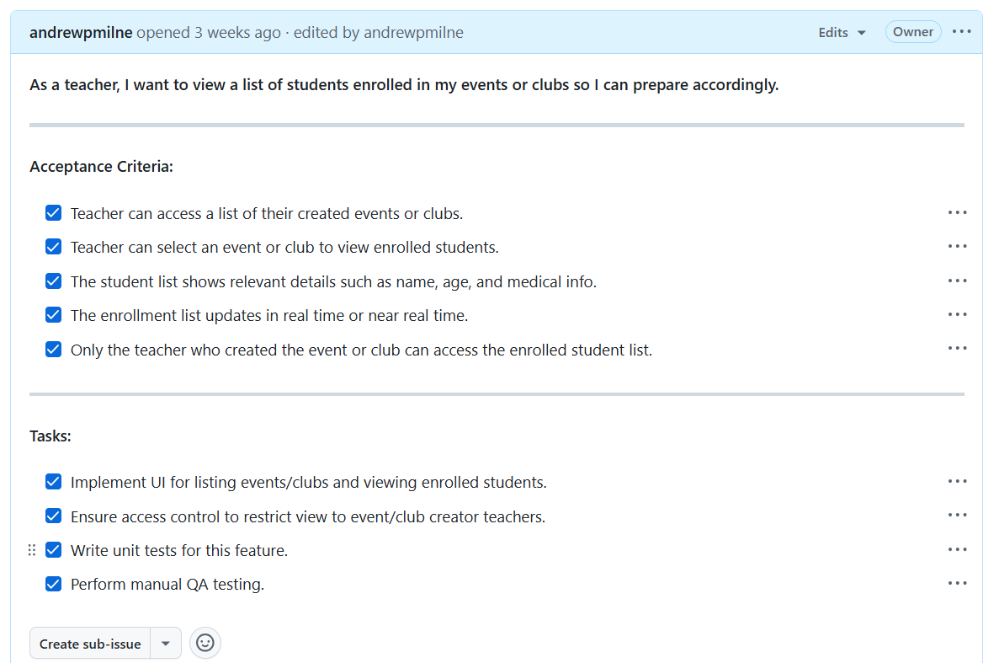

## Iterations and Projects

To ensure the workflow of Epics to User Stories and to create a timeline for the creation of the site, GitHub Projects was then used to plan a series of Iterations for the work required. These were a "working document" and could be adapted throughout the creation process. On some occasions, User Stories intended to be completed in one iteration would be moved to another, or new User Stories were added when it became clear a slightly different approach was needed. In some Iterations, a large number of "Must Have" tasks were included, but these were necessary (particularly in relation to account creation) before future iterations could be undertaken. The projects are linked to the Repository in GitHub and are made public.

### Projects and Iterations Examples

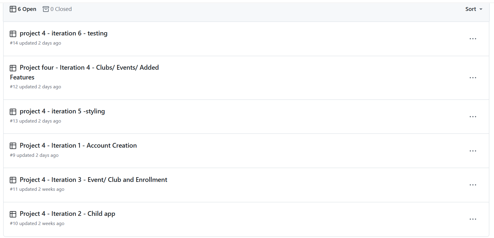  
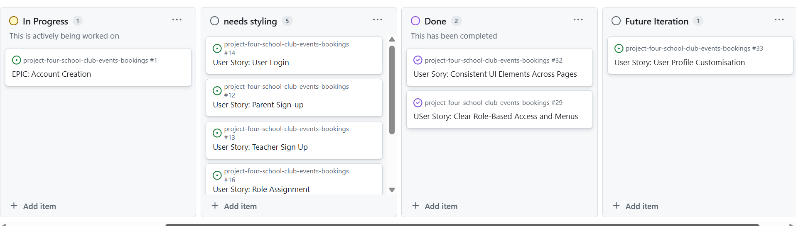  
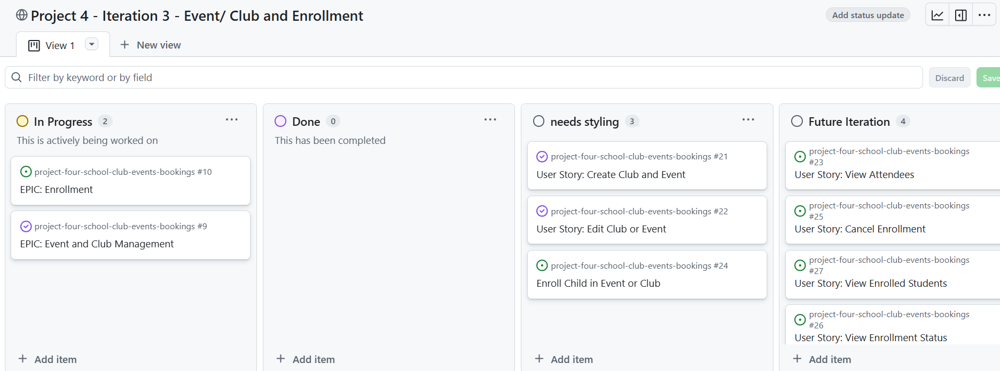

## Features

Please refer to [FEATURES.md](./FEATURES.md) for a full list of features for this site.

## Information Architecture

### Database Design
PostgreSQL was used to create and manage the primary database for the project, ensuring robust and scalable data handling. For unit testing during development, SQLite was used as a lightweight database to simplify setup and improve test performance.  

The ERD for this project was conceived using [dbdiagram.io](https://dbdiagram.io/home).  
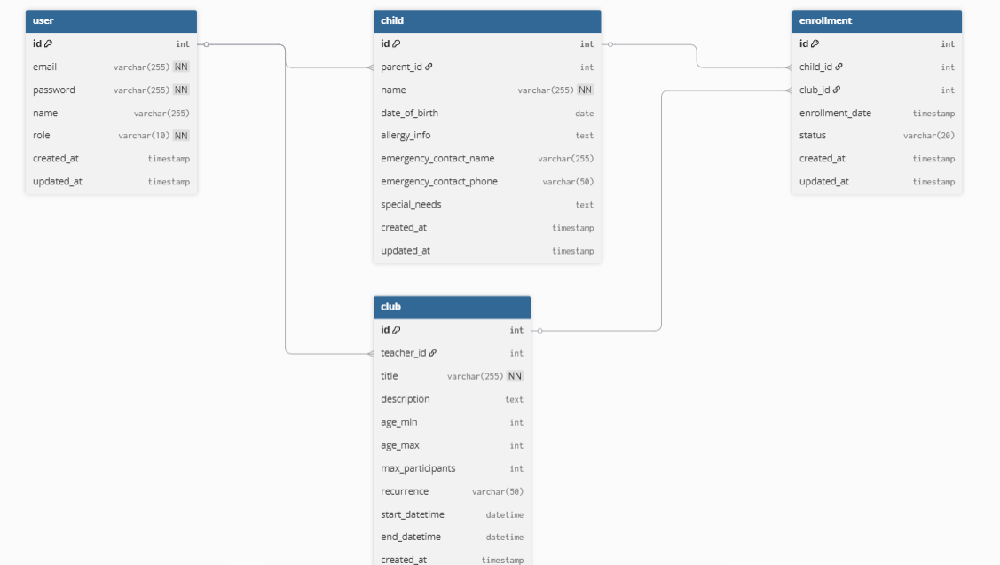

### Data Modelling
1. **User**

A **custom user model** was implemented instead of Django's default `User` model because login is based on **email** rather than username. This allows for more flexible authentication and role-based access control.
```sql
Table user {
  id int [pk, increment]
  email varchar(255) [unique, not null]
  password varchar(255) [not null]
  name varchar(255)
  role varchar(10) [not null]  // 'teacher' or 'parent'
  created_at timestamp
  updated_at timestamp
}

2. **Child**

Although not a "user", a **database table** was needed to store the children created by parents.

```sql
Table child {
  id int [pk, increment]
  parent_id int [ref: > user.id]
  name varchar(255) [not null]
  date_of_birth date
  allergy_info text
  emergency_contact_name varchar(255)
  emergency_contact_phone varchar(50)
  special_needs text
  created_at timestamp
  updated_at timestamp
}

3. **Club**

A **club database table** was required to store the data of clubs and events created by teachers.

```sql
Table club {
  id int [pk, increment]
  teacher_id int [ref: > user.id]
  title varchar(255) [not null]
  description text
  age_min int
  age_max int
  max_participants int
  recurrence varchar(50)  // e.g., 'one-off', 'weekly', 'custom'
  start_datetime datetime
  end_datetime datetime
  created_at timestamp
  updated_at timestamp
}

4. **Enrollment**

An **enrollment database** was required to store the information of children signed up to different clubs and events.

```sql
Table enrollment {
  id int [pk, increment]
  child_id int [ref: > child.id]
  club_id int [ref: > club.id]
  enrollment_date timestamp
  status varchar(20)  // e.g., 'active', 'cancelled'
  created_at timestamp
  updated_at timestamp
}
```
## Design

The site was designed with simplicity in mind to ensure ease of use for both parents and teachers. A colour scheme of blue and white was chosen for the main interface, with red used to indicate "danger" actions such as logout. Primary buttons were styled in blue, while secondary buttons were grey or white, providing a clear visual hierarchy. The main font, Open Sans, was used for body text to enhance readability, while Merriweather was used for headings, contributing to a professional and user-friendly style.

## Technologies Used

### Languages

- **Python 3.13.2:** The primary language used to develop the server-side of the website.  
- **JavaScript (JS):** The primary language used to develop interactive components of the website.  
- **HTML:** The language used to create the website structure.  
- **CSS:** The styling language used to style the website.

### Frameworks and Libraries

- **Django:** Python framework used to create all the server-side logic and manage the backend of the website.  
- **Bootstrap:** CSS framework used to design responsive, mobile-first layouts and style the website quickly and consistently.

### Databases

- **SQLite:** Used as a lightweight database for unit testing during development.  
- **PostgreSQL:** The primary database used to store all application data.

### Dependencies

The project relies on the following Python packages (as specified in `requirements.txt`):

- **asgiref==3.9.1** – ASGI server utilities used by Django.  
- **dj-database-url==0.5.0** – Utility to parse database URLs.  
- **Django==4.2.23** – The primary Python web framework used for the project.  
- **gunicorn==20.1.0** – WSGI HTTP server for running the website in production.  
- **psycopg2==2.9.10** – PostgreSQL database adapter for Python.  
- **setuptools==80.9.0** – Python package management library.  
- **sqlparse==0.5.3** – SQL parsing utilities used internally by Django.  
- **tzdata==2025.2** – Time zone data required by Django for date/time management.  
- **whitenoise==6.9.0** – Middleware to serve static files efficiently in production.

### Other Tools

- **Git:** Version control system used to manage the code.  
- **Heroku:** Cloud platform used to deploy and host the website.
- **pip3:** Package manager used to install dependencies.  
- **Gunicorn:** Web server used to run the website.  
- **Django-allauth:** Authentication library used to create and manage user accounts.  
- **Render:** Cloud platform used to host the website.  
- **GitHub:** Platform used to host the website's source code.  
- **VSCode:** IDE used to develop the website.  
- **Chrome DevTools:** Used to debug and inspect the website.  
- **Google Fonts:** Provided fonts used in the website.
- **Icons8:** Used to create and source icons for the website.
- **dbdiagram.io:** Used to create the ERD.  
- **Code validators:** W3C Validator (HTML), W3C CSS Validator, JSHint (JavaScript), and PEP8 (Python) were used to validate the website’s code.

## Bugs

### Fixed Bugs

1. **Weak password login:** Users were previously able to log in with a weak password. Extra password validation was added to alleviate this issue.
2. **Role-based access issue:** In early versions, users logged in under a particular role were able to access information not relevant to their role by manually typing URLs in the address bar. This was rectified by adding a `role_required` decorator to the relevant views.
3. **User experience (UX) issue:** During testing, it was revealed that the "cards" used for viewing events and children were clickable, but there was no visual indication to the user. This was addressed by using Bootstrap classes and custom CSS to add a hover effect, making it clear that the cards were interactive.
4. **Signing up for multiple clubs concurrently:** During testing, it was discovered that a child could be signed up for two different clubs that ran at the same time. Additional validation was added to prevent overlapping enrolments.

### Bugs Remaining

- **Textarea layout issue:** The large textarea boxes in the forms are too big, and the label appears at the bottom rather than above the field. This creates a minor user experience issue and could be addressed in future iterations.

## Future Improvements

- **Automated notifications:** Parents and teachers could be automatically notified whenever enrolments are made, or club/event details are updated or deleted. This would improve user experience and keep all parties informed in real time.
- **Forgotten password functionality:** This version of the app does not include a password reset feature, as no personal email was attached for security reasons. In a professional or production setting, this functionality could be implemented to allow users to reset their passwords securely via email.
- **Custom User model naming:** The project currently uses a custom `User` model, which clashes with Django's built-in `User` class. Renaming the custom model (e.g., to `CustomUser`) would avoid potential confusion or import conflicts in future versions.


