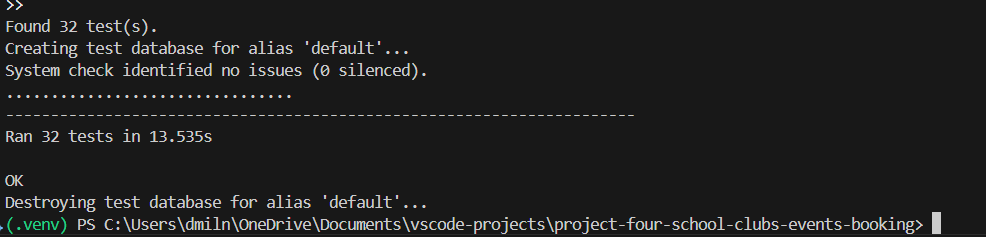
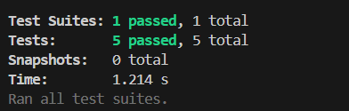
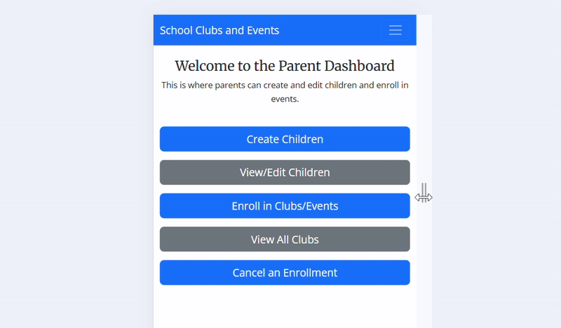
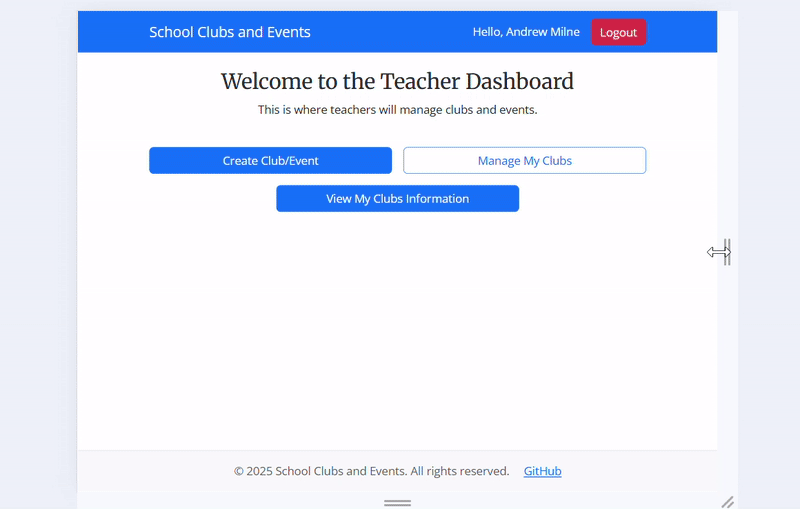
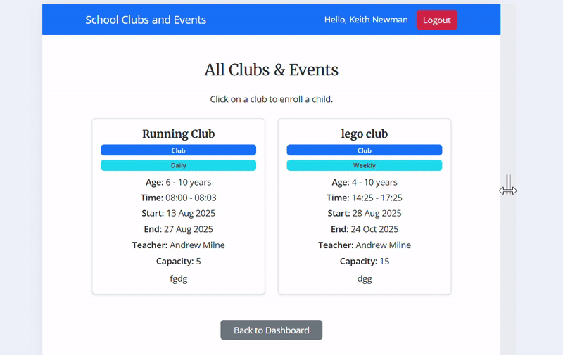

# Testing

## Introduction

Unit tests were used across all apps in this project to automatically verify that individual components worked as expected.  
Manual testing was also employed throughout the development process to catch issues that automated tests might have missed. This included testing by the developer as well as involving third-party testers to ensure the app behaved correctly in real-world scenarios.  

Testing was performed iteratively throughout development to maintain reliability and functionality. The Agile Iterations were then adapted accordingly. Various testing environments were used, including the local development setup and staging environments.

In addition, online linter tools were employed to review code quality, enforce coding standards, and catch potential syntax or stylistic issues before deployment.

## Unit Tests

All four apps were subjected to automated testing using Python to verify that core functionality worked as intended.  
Forms were tested independently to ensure proper operation and to validate that all input constraints and error handling behaved correctly.  

See the screenshot below for examples of the test results:

### JavaScript Testing
Node.js was used as the runtime environment to execute the JavaScript tests. By leveraging Node, the project was able to run automated tests on the frontend code. The test results can be seen in the below screenshot:

## Manual Testing
Manual testing was performed throughout development to complement the automated unit tests. Each feature of the application was actively used and checked to confirm it behaved correctly. See the below tables for more info.

### User

| Test number | User Action                                     | Expected Results                                                               | Y/N |
|------------|-------------------------------------------------|-------------------------------------------------------------------------------|-----|
| 1          | Click on the sign up button                     | User taken to the sign up screen                                              | Y   |
| 2          | Fill out sign up form with valid parent data   | Account created; redirected to login page                                     | Y   |
| 3          | Fill out sign up form with valid teacher data  | Account created; redirected to teacher dashboard                               | Y   |
| 4          | Fill out sign up form with invalid teacher email | Error message displayed; form not submitted                                   | Y   |
| 5          | Fill out sign up form with mismatched passwords | Error message displayed; form not submitted                                   | Y   |
| 6          | Fill out sign up form with short password       | Error message displayed; form not submitted                                   | Y   |
| 7          | Fill out sign up form without uppercase in password | Error message displayed; form not submitted                                   | Y   |
| 8          | Fill out sign up form without number in password | Error message displayed; form not submitted                                   | Y   |
| 9          | Fill out sign up form without special character | Error message displayed; form not submitted                                   | Y   |
| 10         | Try to sign up with email that already exists   | Error message displayed; form not submitted                                   | Y   |
| 11         | Login as parent                                  | Redirected to parent dashboard                                                | Y   |
| 12         | Login as teacher                                 | Redirected to teacher dashboard                                               | Y   |
| 13         | Login with invalid credentials                  | Error message displayed                                                       | Y   |
| 14         | Access teacher dashboard as parent             | Access denied; redirected or error message shown                               | Y   |
| 15         | Click logout                                     | Confirmation dialog appears; user redirected to home page; success message shown | Y   |

### Club
| Test number | User Action                                           | Expected Results                                                                 | Y/N |
|------------|-------------------------------------------------------|---------------------------------------------------------------------------------|-----|
| 1          | Navigate to "Create Club" page                        | Club creation form displayed                                                     | Y   |
| 2          | Fill out form with valid data                         | Club created successfully; redirected to teacher dashboard                       | Y   |
| 3          | Fill out form with duplicate club name               | Error message displayed; club not created                                        | Y   |
| 4          | Fill out form with min_age greater than max_age      | Error message displayed; club not created                                        | Y   |
| 5          | Fill out form with start date in the past            | Error message displayed; club not created                                        | Y   |
| 6          | Fill out form with start time >= end time            | Error message displayed; club not created                                        | Y   |
| 7          | Fill out one-off club with start date != end date    | Error message displayed; club not created                                        | Y   |
| 8          | Fill out form with capacity <= 0                      | Error message displayed; club not created                                        | Y   |
| 9          | List teacher clubs                                     | Page displays all clubs created by the teacher                                    | Y   |
| 10         | Manage a single club                                   | Club management form displayed with existing data                                 | Y   |
| 11         | Update club with valid data                            | Club updated successfully; redirected to list of clubs                             | Y   |
| 12         | Update club with duplicate name                        | Error message displayed; club not updated                                         | Y   |
| 13         | Delete club                                           | Confirmation page displayed; after confirmation, club deleted; redirected to list | Y   |
| 14         | View enrollments for teacher clubs                     | Page lists all children enrolled in teacher’s clubs                               | Y   |
| 15         | View child details for enrolled child                  | Child details page displayed                                                      | Y   |
| 16         | View child details for unenrolled child                | Error message displayed; redirected to enrollments page                            | Y   |
| 17         | Navigate to teacher dashboard                          | Dashboard loads correctly                                                         | Y   |

### Child
| Test number | User Action                                      | Expected Results                                                                 | Y/N |
|------------|--------------------------------------------------|---------------------------------------------------------------------------------|-----|
| 1          | Navigate to "Create Child" page                  | Child creation form displayed                                                    | Y   |
| 2          | Fill out form with valid data                    | Child created successfully; redirected to parent dashboard                        | Y   |
| 3          | Fill out form with age < 4                       | Error message displayed; child not created                                       | Y   |
| 4          | Fill out form with age > 18                      | Error message displayed; child not created                                       | Y   |
| 5          | Fill out form with duplicate child details      | Error message displayed; child not created                                       | Y   |
| 6          | Submit form with invalid data                    | Error message displayed; child not created                                       | Y   |
| 7          | View children cards                              | Page displays all children for the logged-in parent                               | Y   |
| 8          | Navigate to edit a child                          | Edit form pre-populated with child details                                        | Y   |
| 9          | Update child details with valid data             | Child details updated successfully; redirected to children cards page            | Y   |
| 10         | Update child details with invalid data           | Error message displayed; child details not updated                                | Y   |
| 11         | Delete child                                     | Confirmation page displayed; after confirmation, child deleted; redirected       | Y   |
| 12         | Navigate to view all clubs                        | Page lists all clubs and events sorted by start date/time                         | Y   |
| 13         | Access "Create Child" page without login         | Redirected to login page                                                         | Y   |
| 14         | Access children cards page without login         | Redirected to login page                                                         | Y   |
| 15         | Access edit child page without login             | Redirected to login page                                                         | Y   |
| 16         | Access delete child page without login           | Redirected to login page                                                         | Y   |

### Enrollment
| Test number | User Action                                        | Expected Results                                                                 | Y/N |
|------------|----------------------------------------------------|---------------------------------------------------------------------------------|-----|
| 1          | Navigate to "Create Enrollment" page               | Enrollment form displayed with child dropdown limited to parent’s children       | Y   |
| 2          | Enroll a child into a club with valid data        | Enrollment saved successfully; success message displayed; redirected to dashboard| Y   |
| 3          | Attempt to enroll a child not belonging to parent | Error message displayed; enrollment not saved                                     | Y   |
| 4          | Attempt to enroll a child already enrolled        | Error message displayed; duplicate enrollment prevented                           | Y   |
| 5          | Attempt to enroll a child outside club age limits | Error message displayed; enrollment not saved                                     | Y   |
| 6          | Attempt to enroll in a full club                  | Error message displayed; enrollment not saved                                     | Y   |
| 7          | Use invalid form data                              | Error message displayed; enrollment not saved                                     | Y   |
| 8          | View "Cancel Enrollment" page                      | Page lists all enrollments for the parent’s children                              | Y   |
| 9          | Cancel an enrollment                               | Enrollment deleted; success message displayed; redirected to cancel enrollment page| Y   |
| 10         | Navigate to "Enroll in specific club" card        | Enrollment form displayed with selected club pre-filled                           | Y   |
| 11         | Check child dropdown is limited to parent’s children | Only parent’s children are listed in dropdown                                     | Y   |

### Responsiveness
The responsiveness of the site was tested in all pages on various screen sizes. See the below gifs as evidence of readable and clear screens at different sizes.

### Browsers
The product was tested in Edge, Chrome and Firefox as well as on Safari on an iOS device. 